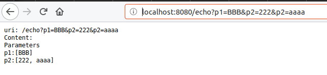

# Netty Http Server

Simple Demo of a NIO Http Server using Netty.

## Req

* Java 8+
* Maven 3+

## Package

    mvn package

## Run

    java -DPORT=8080 -jar target/netty-http.server.jar                                                                                                                                                                          ✘ hldias@hp  /opt/dev/repository/netty-http-server   master ●✚  java -DPORT=8888 -jar target/netty-http-server.jar

## Open

    http://localhost:8080/
    http://localhost:8080/time
    http://localhost:8080/echo?p1=BBB&p2=222&p2=aaaa

